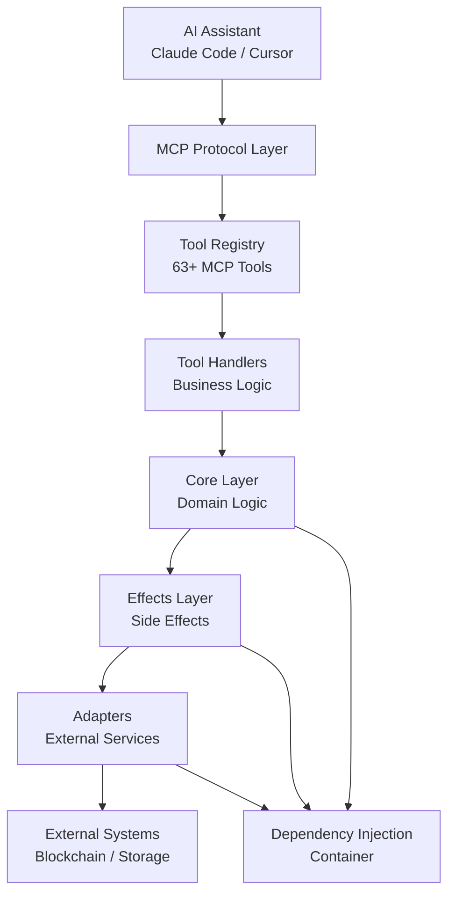
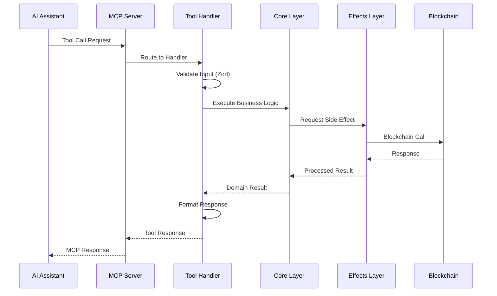

# Architecture

Understanding Wallet Agent's architecture helps you build better applications, troubleshoot issues, and contribute to the project effectively.

## System Overview

Wallet Agent is built as a **Model Context Protocol (MCP) server** that bridges AI assistants with Web3 functionality. It follows clean architecture principles with clear separation of concerns.



## Core Principles

### 1. Dependency Injection

All components use dependency injection for testability and modularity:

```typescript
// Container manages all dependencies
const container = getContainer()
const walletEffects = container.walletEffects
const contractAdapter = container.contractAdapter
```

**Benefits:**
- Easy testing with mock dependencies
- Clean separation of concerns  
- Configurable implementations
- Isolated component testing

### 2. Effects Pattern

Side effects (blockchain calls, file I/O, network requests) are isolated in the Effects layer:

```typescript
// Effects handle all external interactions
export class WalletEffects {
  async getCurrentAccount(): Promise<Account> {
    // Blockchain interaction isolated here
  }
}
```

**Benefits:**
- Pure business logic in Core layer
- Testable with mock effects
- Clear separation of pure/impure code
- Easier debugging and monitoring

### 3. Adapter Pattern

External services are accessed through adapters with consistent interfaces:

```typescript
// Adapters provide consistent interfaces
export interface ContractAdapter {
  getContract(name: string): Promise<Contract>
  storeContract(contract: Contract): Promise<void>
}
```

**Benefits:**
- Swappable implementations
- Consistent error handling
- Easy mocking for tests
- Future-proof abstractions

## Layer Architecture

### MCP Protocol Layer

**Purpose**: Handle Model Context Protocol communication with AI assistants.

**Components:**
- `server.ts` - MCP server setup and request routing
- `tools/definitions.ts` - Tool schema definitions
- `tools/handler-registry.ts` - Tool registration and execution

**Responsibilities:**
- Parse and validate MCP requests
- Route tool calls to appropriate handlers
- Format responses for AI assistants
- Handle MCP-specific errors and protocols

### Tool Handlers Layer

**Purpose**: Implement business logic for each MCP tool.

**Location**: `src/tools/handlers/`

**Structure:**
```
handlers/
├── wallet-handlers.ts          # Wallet connection, balance checks
├── transaction-handlers.ts     # Transaction sending, monitoring
├── contract-handlers.ts        # Contract read/write operations
├── token-handlers.ts           # ERC-20 token operations
├── contract-testing-handlers.ts # Contract simulation and testing
├── wagmi-abi-handlers.ts       # ABI extraction and analysis
└── encrypted-key-handlers.ts   # Secure key management
```

**Responsibilities:**
- Validate input parameters using Zod schemas
- Implement tool-specific business logic
- Call appropriate Core/Effects layer methods
- Format user-friendly responses
- Handle tool-specific error conditions

### Core Layer

**Purpose**: Pure business logic and domain models.

**Location**: `src/core/`

**Key Modules:**
```
core/
├── contract-resolution.ts   # Contract and token resolution
├── contract-testing.ts      # Contract simulation engine
├── transaction-helpers.ts   # Transaction building utilities
├── validators.ts            # Input validation logic
├── formatters.ts           # Data formatting utilities
└── builders.ts             # Object construction helpers
```

**Characteristics:**
- **Pure Functions** - No side effects, testable
- **Domain Logic** - Business rules and validations
- **Immutable Data** - Uses readonly types and immutability
- **Framework Agnostic** - Independent of external libraries

### Effects Layer

**Purpose**: Handle all side effects and external interactions.

**Location**: `src/effects/`

**Key Effects:**
```
effects/
├── wallet-effects.ts        # Blockchain wallet operations
├── transaction-effects.ts   # Transaction submission and monitoring
├── contract-effects.ts      # Smart contract interactions
├── token-effects.ts         # Token balance and transfer operations
└── file-reader.ts           # File system operations
```

**Responsibilities:**
- Blockchain RPC calls
- File system operations
- Network requests
- Caching and persistence
- Error handling and retries

### Adapters Layer

**Purpose**: Abstract external service interfaces.

**Location**: `src/adapters/`

**Key Adapters:**
```
adapters/
├── wallet-adapter.ts        # Wagmi wallet integration
├── contract-adapter.ts      # Contract ABI management
├── token-adapter.ts         # Token registry and metadata
└── wagmi-adapter.ts         # Wagmi configuration management
```

**Benefits:**
- Consistent interfaces across different providers
- Easy swapping of implementations
- Simplified testing with mock adapters
- Future-proof architecture for new integrations

## Data Flow

### Request Processing Flow



### Example: Sending a Transaction

1. **AI Request**: "Send 1 ETH to 0x123..."
2. **Tool Handler**: `SendTransactionHandler`
   - Validates recipient address and amount
   - Converts to proper types
3. **Core Logic**: `transaction-helpers.ts`
   - Builds transaction parameters
   - Validates transaction structure
4. **Effects**: `transaction-effects.ts`
   - Submits to blockchain
   - Monitors for confirmation
5. **Response**: Formatted success message with transaction details

## Configuration System

### Environment-Based Configuration

```typescript
// Environment configuration
export interface EnvironmentConfig {
  NODE_ENV: 'development' | 'production' | 'test'
  WALLET_PRIVATE_KEY?: string
  DEBUG?: string
  RPC_URL_ETHEREUM?: string
}
```

### Container Configuration

The dependency injection container configures all components:

```typescript
export class Container {
  // Lazy initialization of all dependencies
  get walletEffects(): WalletEffects {
    return this._walletEffects ??= new WalletEffects(this.wagmiConfig)
  }
  
  get contractAdapter(): ContractAdapter {
    return this._contractAdapter ??= new WagmiContractAdapter()
  }
}
```

### Test Configuration

Test environments use isolated containers:

```typescript
// Test container with mock implementations
export class TestContainer extends Container {
  get walletEffects(): MockWalletEffects {
    return this._mockWalletEffects ??= new MockWalletEffects()
  }
}
```

## Caching Strategy

### Multi-Level Caching

**Level 1: Container Singletons**
- Effect and adapter instances
- Configuration objects
- Shared resources

**Level 2: Effects Caching**
```typescript
// PublicClient caching per chain
private clientCache = new Map<number, PublicClient>()

getPublicClient(chainId: number): PublicClient {
  return this.clientCache.get(chainId) ?? this.createClient(chainId)
}
```

**Level 3: Contract Resolution Cache**
```typescript
// Contract resolution caching
const contractResolutionCache = new Map<string, ResolvedContract>()

export function resolveContract(name: string): ResolvedContract {
  const cacheKey = `${name}:${chainId}`
  return contractResolutionCache.get(cacheKey) ?? resolveAndCache(name)
}
```

### Cache Invalidation

Caches are cleared when:
- Chain configuration changes
- Contract configurations update
- Test environments reset
- Manual cache clearing requested

## Error Handling Strategy

### Layered Error Handling

**MCP Layer Errors:**
```typescript
// MCP-specific error codes
throw new McpError(ErrorCode.InvalidParams, "Invalid address format")
throw new McpError(ErrorCode.InternalError, "Blockchain connection failed")
```

**Domain Layer Errors:**
```typescript
// Business logic errors
throw new Error("Insufficient balance for transaction")
throw new Error("Contract not found in configuration")
```

**Effects Layer Errors:**
```typescript
// External service errors with context
throw new Error(`RPC call failed: ${rpcError.message}`)
throw new Error(`File not found: ${filePath}`)
```

### Error Recovery Patterns

**Automatic Retries:**
```typescript
// Retry blockchain calls with exponential backoff
async function withRetry<T>(operation: () => Promise<T>): Promise<T> {
  for (let attempt = 1; attempt <= MAX_RETRIES; attempt++) {
    try {
      return await operation()
    } catch (error) {
      if (attempt === MAX_RETRIES) throw error
      await delay(Math.pow(2, attempt) * 1000)
    }
  }
}
```

**Graceful Degradation:**
```typescript
// Fallback to cached data when live data unavailable
async function getTokenBalance(address: string): Promise<bigint> {
  try {
    return await fetchLiveBalance(address)
  } catch (error) {
    logger.warn('Live balance failed, using cached', { error })
    return getCachedBalance(address) ?? 0n
  }
}
```

## Security Architecture

### Private Key Management

```typescript
// Encrypted storage with session management
export class EncryptedKeyStore {
  private decryptedKeys = new Map<string, string>()
  private sessionTimeout = 30 * 60 * 1000 // 30 minutes
  
  async unlock(masterPassword: string): Promise<void> {
    // Decrypt keys into memory
    // Set automatic cleanup timer
  }
  
  lock(): void {
    // Clear all decrypted keys from memory
    // Cancel session timers
  }
}
```

### Input Validation

All user inputs validated with Zod schemas:

```typescript
const TransactionSchema = z.object({
  to: z.string().refine(isAddress, 'Invalid Ethereum address'),
  value: z.string().refine(isValidAmount, 'Invalid amount format'),
  gasLimit: z.number().optional().refine(isValidGas, 'Invalid gas limit')
})
```

### Secure Defaults

- Mock mode enabled by default
- Private keys never logged
- Session timeouts for sensitive operations
- Comprehensive input sanitization

## Performance Optimizations

### Lazy Loading

Components initialized only when needed:

```typescript
// Lazy initialization of expensive resources
get wagmiConfig(): Config {
  return this._wagmiConfig ??= createConfig({
    chains: getAllChains(),
    transports: createTransports()
  })
}
```

### Connection Pooling

Reuse blockchain connections:

```typescript
// Shared client instances per chain
private static clients = new Map<number, PublicClient>()

static getClient(chainId: number): PublicClient {
  return this.clients.get(chainId) ?? this.createClient(chainId)
}
```

### Batch Operations

Group related operations:

```typescript
// Batch multiple contract reads
const results = await multicall({
  contracts: [
    { address: tokenA, functionName: 'balanceOf', args: [account] },
    { address: tokenB, functionName: 'balanceOf', args: [account] },
    { address: tokenC, functionName: 'balanceOf', args: [account] }
  ]
})
```

## Testing Architecture

### Test Isolation

Each test gets a fresh container:

```typescript
describe('Contract Operations', () => {
  let testContainer: TestContainer
  
  beforeEach(() => {
    testContainer = TestContainer.createForTest({})
  })
  
  afterEach(() => {
    testContainer.cleanup()
  })
})
```

### Mock System

Comprehensive mocking for all external dependencies:

```typescript
export class MockWalletEffects implements WalletEffects {
  async getCurrentAccount(): Promise<Account> {
    return {
      address: MOCK_ADDRESSES[0],
      balance: parseEther('10000')
    }
  }
}
```

### Test Categories

**Unit Tests**: Individual components in isolation
**Integration Tests**: Component interactions  
**E2E Tests**: Full workflows with real blockchain
**Contract Tests**: Smart contract behavior validation

## Extension Points

### Adding New Tools

1. **Define Tool Schema**:
```typescript
// Add to tools/definitions.ts
{
  name: "my_new_tool",
  description: "My new tool functionality",
  inputSchema: {
    type: "object",
    properties: {
      param: { type: "string", description: "Parameter description" }
    }
  }
}
```

2. **Implement Handler**:
```typescript
// Create tools/handlers/my-tool-handlers.ts
export class MyNewToolHandler extends BaseToolHandler {
  constructor() {
    super("my_new_tool", "Tool description")
  }
  
  async execute(args: unknown): Promise<ToolResponse> {
    // Implementation here
  }
}
```

3. **Register Handler**:
```typescript
// Add to tools/handlers.ts
import { myNewToolHandlers } from "./handlers/my-tool-handlers.js"

toolRegistry.registerAll([
  ...existingHandlers,
  ...myNewToolHandlers
])
```

### Adding New Chains

1. **Built-in Chain**: Add to `chains.ts`
2. **Custom Chain**: Use existing custom chain tools
3. **Special Features**: Extend chain-specific adapters

### Adding New Effects

1. **Create Effect Interface**: Define contract in Core layer
2. **Implement Effect**: Add to Effects layer
3. **Mock Implementation**: Create test version
4. **Register in Container**: Add to dependency injection

## Debugging & Monitoring

### Logging System

Structured logging with context:

```typescript
const logger = createLogger('contract-operations')

logger.info({ msg: 'Contract call initiated', contract, function: functionName })
logger.error({ msg: 'Contract call failed', error, contract, function: functionName })
```

### Debug Mode

Enable detailed logging:

```bash
export DEBUG="wallet-agent:*"
```

### Performance Monitoring

Track operation timing:

```typescript
const timer = performance.now()
const result = await operation()
const duration = performance.now() - timer

logger.debug({ msg: 'Operation completed', duration, operation: 'contractCall' })
```

## Future Architecture Plans

### Planned Improvements

1. **Plugin System**: Hot-loadable extensions
2. **Event Sourcing**: Full operation audit trail  
3. **Metrics Collection**: Detailed usage analytics
4. **Distributed Caching**: Multi-instance cache sharing
5. **GraphQL Layer**: Structured data access
6. **WebSocket Support**: Real-time updates

### Extension Opportunities

- Custom blockchain integrations
- Additional wallet provider support
- Advanced caching strategies
- Machine learning integration
- Automated optimization suggestions

---

Understanding this architecture helps you build better applications and contribute effectively to Wallet Agent's continued development! 🏗️

👉 **[Continue to Contract Development →](contract-development.md)**